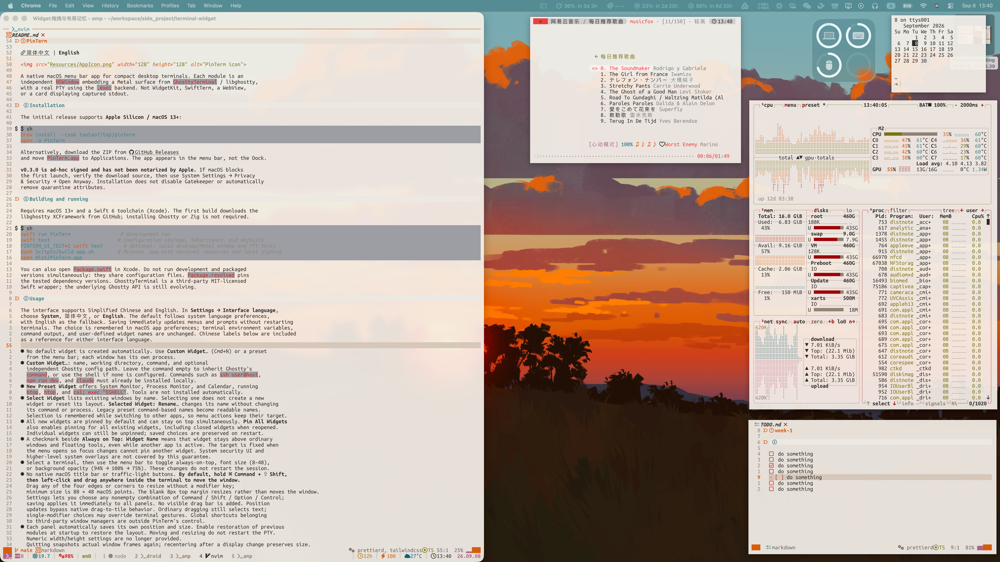

# PinTerm

[简体中文](README.zh-CN.md) | **English**


## Preview



<video src="./Resources/media/pinterm-demo.mp4" width="100%" autoplay muted loop controls playsinline></video>

A native macOS menu bar app for compact desktop terminals. Each module is an
independent `NSWindow` embedding a Metal surface from `GhosttyTerminal` / libghostty,
with a real PTY using the `.exec` backend. Not WidgetKit, SwiftTerm, a WebView,
or a card displaying captured stdout.

## Installation

The initial release supports **Apple Silicon / macOS 13+**:

```sh
brew install --cask taotao7/tap/pinterm
open -a PinTerm
```

Alternatively, download the ZIP from [GitHub Releases](https://github.com/taotao7/PinTerm/releases)
and move `PinTerm.app` to Applications. The app appears in the menu bar, not the Dock.

**v0.3.0 is ad-hoc signed and has not been notarized by Apple.** If macOS blocks
the first launch, verify the download source, then use System Settings → Privacy
& Security → Open Anyway. Installation does not disable Gatekeeper or automatically
remove quarantine attributes.

## Building and running

Requires macOS 13+ and a Swift 6 toolchain (Xcode). The first build downloads the
libghostty XCFramework from GitHub; installing Ghostty or Zig is not required.

```sh
swift run PinTerm                 # Development run
swift test                       # Configuration storage, inheritance, and defaults
PINTERM_UI_TEST=1 swift test       # Optional: local desktop/Metal window and PTY tests
bash Scripts/build-app.sh        # Release .app with terminal resources and local signing
open dist/PinTerm.app
```

You can also open `Package.swift` in Xcode. Do not run development and packaged
versions simultaneously: they share configuration files. `Package.resolved` pins
the tested dependency versions. GhosttyTerminal is a third-party MIT-licensed
Swift wrapper; the underlying Ghostty API is still evolving.

## Usage

The interface supports Simplified Chinese and English. In **Settings → Interface language**,
choose **System**, **简体中文**, or **English**. The default follows system language preferences,
with English as the fallback. Saving immediately updates menus and prompts without restarting
terminals. The choice is remembered in macOS app preferences; terminal environment variables,
command output, and user-defined widget names are unchanged. Chinese labels below are included
as a reference for either interface language.

- No default widget is created automatically. Use **Custom Widget…** (Cmd+N) or a preset
  from the menu bar; each window has its own process.
- **Custom Widget…**: name, working directory, command, and optional
  independent Ghostty config path. Leave the command empty to inherit Ghostty's
  `command`, or use the shell if none is configured. Commands such as `ssh user@host`,
  `npm run dev`, and `claude` must already be installed locally.
- **New Preset Widget** offers System Monitor, Process Monitor, and Calendar, running
  `btop`, `htop`, and `cal; exec "$SHELL"`. Tools are not installed automatically.
- **Select Widget** lists existing windows by name. Selecting one does not create a new
  widget or reset its layout. **Selected Widget: Rename…** changes its name without changing
  its command or process. Legacy preset command-based names become readable names.
  Selection is remembered while switching to other apps, so menu actions keep their target.
- All new widgets are pinned by default and can stay on top simultaneously. **Pin All Widgets**
  also enables pinning for all existing widgets, including closed widgets when reopened.
  Individual widgets can still be unpinned; saved choices are preserved on restart.
- A checkmark beside **Always on Top: Widget Name** means that widget stays above ordinary
  windows and floating tools, even while another app is active. The target is fixed when
  the menu opens so focus changes cannot pin another widget. System security UI and
  higher-level system overlays are not covered by this guarantee.
- Select a terminal, then use the menu bar to toggle always-on-top, font size (8–48),
  or background opacity (94% → 100% → 75%). These changes do not restart the session.
- No native macOS title bar or traffic-light buttons. **By default, hold ⌘ Command + ⇧ Shift,
  then left-click and drag anywhere inside the terminal to move the window.**
  Drag any of the four edges or corners to resize without a modifier key;
  minimum size is 80 × 48 macOS points. The blank 8px top margin resizes rather than moves the window.
  Settings lets you choose any nonempty combination of Command / Shift / Option / Control;
  saving applies it immediately to all panels. No visible drag bar is added. Position
  updates bypass native drag-to-tile behavior. Ordinary dragging still selects text;
  single-modifier choices may override terminal gestures. Global shortcuts belonging
  to third-party window managers are outside PinTerm's control.
- Each panel automatically saves its own position and size. Enable restoration of previous
  modules at startup to restore the layout. Moving and resizing do not restart the PTY.
  Numeric width/height settings are no longer provided.
  Quitting snapshots actual window frames again; recentering after a display change preserves size.
- **关闭当前模块** (Close current module) / Cmd+W closes the window after confirmation.
- Cmd+C / Cmd+V copy and paste; Cmd+` cycles windows; Ctrl+C goes to the terminal.
- Windows join all Spaces and can appear as auxiliary windows in fullscreen spaces.
  Always-on-top is on by default; no Dock icon is shown.
- Closing a window confirms and ends its session, but preserves its name, position,
  size, and pin state. Use **Reopen Widget** to restore it by name; choosing the same
  preset also prefers a previously closed widget. Closed widgets remain available
  after restarting the app without running automatically. Quitting the whole app
  confirms and preserves module configuration.

## Ghostty configuration and startup

**设置…** (Settings, Cmd+,) controls the default command, working directory,
independent config file, window restoration, and launch at login.

- **Inherits local configuration by default:** reads the XDG directory
  (`$XDG_CONFIG_HOME/ghostty`, defaulting to `~/.config/ghostty`), followed by
  `~/Library/Application Support/com.mitchellh.ghostty`. Within each directory,
  reads `config` followed by `config.ghostty`.
- Resolves relative and optional `config-file` references and reports reference cycles.
  Themes are looked up in the XDG `themes` directory first, then in the theme resources
  of `/Applications/Ghostty.app` or `~/Applications/Ghostty.app`. Absolute theme paths
  and light/dark theme pairs are supported. Your original Ghostty config is not modified.
- When a global independent config path is set, **only that config is loaded**.
  A module's own `configFile` takes precedence over the global path.
- Enable **不载入 Ghostty 配置中的 tmux 启动命令** (Skip tmux startup commands in Ghostty config)
  to reset `command` / `initial-command` values containing `tmux` to engine defaults,
  while preserving appearance settings. Referenced config files are handled too.
  On by default starting in v0.2.2 (off in v0.2.1). Old settings missing this field
  use the new default; explicitly saved choices are preserved.
  Changes apply to new windows and the next restoration. Explicit
  module commands still take precedence and are not filtered. This option does
  **not** prevent tmux launched by shell scripts such as `.zshrc`.
- Ghostty parses fonts, colors, cursor settings, and opacity; the wrapper's default
  theme is not imposed. New modules do not override font size or opacity. Existing
  overrides remain until cleared with **当前窗口：恢复配置字号与透明度**
  (Current window: restore configured font size and opacity).
- Explicit module commands override Ghostty's `command` / `initial-command`.
  Presets and entered commands run through the macOS account's interactive login shell
  (`-lic`), using that shell's syntax. With zsh, `.zprofile` and `.zshrc` are read,
  including Homebrew PATH, environment variables, and aliases. Startup-file commands
  also execute. An empty command still inherits Ghostty's startup behavior unchanged.
- The default command pre-fills the custom widget dialog. With **Restore previous modules
  on launch** enabled, open widgets return with their saved commands. Otherwise the app
  starts with only its menu bar icon; saved widgets remain available under **Reopen Widget**.
- Configuration changes apply to new windows, without restarting running tasks.
- Launch at login uses `SMAppService.mainApp`; it is not registered by default.
  Enable it yourself in Settings. If approval is required, the app opens macOS login
  item settings. Keep the `.app` at a stable location, such as Applications, first.

Inheritance covers terminal configuration supported by libghostty, not the full
Ghostty app's window management. For example, Ghostty tab and split-window shortcuts
do not automatically become PinTerm features. Without config files, native engine
defaults apply. Configuration errors are reported rather than silently switching themes.

## Restoration and JSON

Modules are saved atomically to `~/Library/Application Support/PinTerm/modules.json`.
Global settings live in `settings.json` in the same directory; macOS owns login-item status.
**Restarting restores windows and launch configuration, not processes, scrollback,
or the shell's current state.** The saved directory is the launch directory and does
not follow `cd` inside the shell. Custom commands run again: do not save commands with
side effects you do not want repeated automatically. Quit the app before editing JSON.

```json
[
  {
    "id": "8EE58FE1-307C-4620-B515-F6FDF5037327",
    "title": "Dev server",
    "workingDirectory": "/Users/you/project",
    "command": "npm run dev",
    "fontSize": 14,
    "opacity": 0.94,
    "alwaysOnTop": false,
    "frame": "{{100, 200}, {640, 360}}"
  }
]
```

`command`, `configFile`, `fontSize`, `opacity`, and `frame` are optional; omitting font
size and opacity means inheritance. Corrupt JSON is not overwritten: the app reports
the problem and stops automatic saving for that run. If a display change leaves
the top of the window off-screen, the window is centered again.

## Performance sampling

```sh
PINTERM_PERF_TEST=1 swift test -c release --filter PerformanceTests
```

Measured on 2026-09-08, Apple M2 / 16GB, in the local Release test-host process:

| Scenario | Average CPU (100% = one core) | RSS |
| --- | ---: | ---: |
| Baseline, no windows | 0.01% | 32.0 MiB |
| One idle window | 0.50% | 64.1 MiB |
| Four idle windows | 1.62% | 84.4 MiB |
| Four windows, each outputting two lines at approximately 20Hz | 2.69% | 95.2 MiB |
| After closing all windows | 0.18% | 49.0 MiB |

Each scenario has a 3-second warm-up and a 10-second sampling period. Windows are
640×360 and partially overlap, with opaque backgrounds and cursor blinking disabled.
User configuration is not loaded. CPU is the increase in process user and kernel CPU
time over the interval; RSS is resident memory at the end of sampling.

These numbers include test-framework overhead but **exclude shell child processes,
WindowServer, GPU usage, and whole-system energy consumption**. This is a short,
light-load benchmark, not a measure of full-screen log throughput, complex TUIs, or
long-running behavior, nor proof of the absence of memory leaks. Memory did not return
to its initial level after closing; engine/system caches may contribute, and longer
repeated sampling is needed to investigate further.

## Distribution limitations

App Sandbox is intentionally disabled to support arbitrary local shells. The packaging
script only signs ad hoc; production distribution still requires your own Developer ID
signature and notarization. The app is not published on the App Store. Closing or
quitting ends terminal-managed tasks, but explicitly detached daemons are not guaranteed
to terminate with the app.

## Licenses and rebuilding

PinTerm source is licensed under [MIT](LICENSE). The icon was generated for this project.
Third-party terminal engines, fonts, and libraries retain their own licenses; see
[third-party notices](THIRD_PARTY_NOTICES.md). Corresponding third-party source archives
are published alongside the binary. [Rebuilding and relinking instructions](docs/REBUILDING.md)
describe how to use modified libraries. The app's **许可证与第三方源码…**
(Licenses and third-party source) menu opens the bundled notices.
