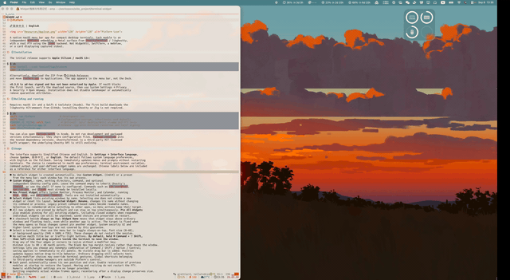

# PinTerm

**简体中文** | [English](README.md)


## 预览




原生 macOS 菜单栏微型终端。每个模块是独立 `NSWindow`，嵌入
`GhosttyTerminal` / libghostty 的 Metal surface，使用 `.exec` 后端运行真实 PTY。
不是 WidgetKit，不使用 SwiftTerm、WebView 或模拟 stdout。

## 安装

首版支持 **Apple Silicon / macOS 13+**：

```sh
brew install --cask taotao7/tap/pinterm
open -a PinTerm
```

也可从 [GitHub Releases](https://github.com/taotao7/PinTerm/releases) 下载 ZIP，
将 `PinTerm.app` 放入 Applications。应用只显示在菜单栏，不显示 Dock 图标。

**v0.4.0 为 ad-hoc 签名，尚未经过 Apple 公证。** 若系统阻止首次打开，
确认下载来源后按 macOS「系统设置 → 隐私与安全性 → 仍要打开」流程操作。
安装脚本不会关闭 Gatekeeper，也不会自动移除隔离标记。

## 运行

需要 macOS 13+、Swift 6 工具链（Xcode）。首次构建需要从 GitHub 下载
libghostty XCFramework，无需安装 Ghostty 或 Zig。

```sh
swift run PinTerm                 # 开发运行
swift test                       # 配置存储、继承与默认值测试
PINTERM_UI_TEST=1 swift test       # 可选：本机桌面/Metal 实际窗口、PTY 测试
bash Scripts/build-app.sh        # Release .app，包含终端资源，临时本地签名
open dist/PinTerm.app
```

也可用 Xcode 打开 `Package.swift`。不要同时运行开发版本和打包版本：它们共享配置文件。
`Package.resolved` 固定已验证的依赖版本；GhosttyTerminal 是第三方 MIT Swift 封装，
其底层 Ghostty API 仍在演进。

## 使用

- 不再自动创建默认组件。从菜单栏选择 **自定义模块…**（Cmd+N）或预设，每个窗口独立进程。
- **自定义模块…**：名称、工作目录、命令、可选独立 Ghostty 配置路径。
  命令留空继承 Ghostty 的 `command`（未设置时使用 shell）。
  可输入 `ssh user@host`、`npm run dev`、`claude` 等本机已安装命令。
- **新建预设组件**提供「系统监控」「进程监控」「日历」，分别运行 `btop`、`htop`、`cal; exec "$SHELL"`；不自动安装工具。
- **选择组件**按名称列出已有窗口，点击只切换到该组件，不会新建或重置布局。
  **当前组件：重命名…**可修改名称，不改变命令或终端进程；旧预设的命令式名称会转换为易读名称。
  选中的组件会被记住，切到其他应用后仍可从菜单操作它。
- 所有新建组件默认置顶，可以同时置顶多个组件。**全部组件置顶**可一次开启所有已有组件的置顶，
  包括已关闭组件下次重新打开时的状态；仍可单独取消置顶，重启时保留已保存的选择。
- **保持置顶: 组件名称**的勾选表示该组件已启用置顶，位于普通窗口及浮动工具窗口上方，切换应用不会隐藏。
  菜单打开时固定操作目标，避免焦点变化导致操作到其他组件。
  系统安全界面及更高层级的系统浮层不在置顶保证范围内。
- 点选终端后，菜单栏可切换该窗口置顶、字号（8–48）、背景透明度
  （94% → 100% → 75%）。调整不会重启 session。
- 窗口无 macOS 标题栏、无红黄绿按钮。**默认按住 ⌘ Command + ⇧ Shift，
  在终端内部按下鼠标左键拖动窗口**。
  直接拖动上、下、左、右四条边缘或四角调整大小，无需按快捷键，最小 80 × 48（macOS 点数）。
  顶部 8px 空白边缘也用于缩放，不再用于移动窗口。
  设置中可自定义 Command / Shift / Option / Control 的任意非空组合，保存后立即应用到所有面板。
  不增加可见的顶部长条，通过更新窗口位置避开原生拖动贴边分屏。普通拖动仍用于文本选择；
  自定义单键组合可能覆盖终端手势。第三方窗口管理工具的全局快捷键不由 PinTerm 控制。
- 每个面板的位置和大小都会自动单独保存，启动时恢复上次模块即可还原布局；
  移动和缩放不会重启 PTY。不再提供手动输入宽高的设置。
  退出时再次读取实际窗口布局保存；显示器变化导致重新居中时仍保留尺寸。
- 选中组件后可从菜单以 4 点步进调整圆角半径（0–48 点）；0 为方角，调整立即生效并单独保存。
- 菜单栏 **关闭当前模块** / Cmd+W 关闭窗口（会确认）。
- Cmd+C / Cmd+V 复制粘贴，Cmd+` 循环窗口；Ctrl+C 发给终端。
- 窗口加入所有 Spaces，可辅助显示在全屏空间；置顶默认开启，不在 Dock 显示。
- 关闭窗口会确认并结束 session，但保留名称、位置、大小和置顶状态。
  从 **重新打开组件** 按名称恢复；再次选择相同预设也会优先恢复已关闭的组件。
  已关闭的组件重启应用后仍保留在重新打开菜单中，不会自动运行。
  退出整个 App 会确认并保留配置。

## Ghostty 配置与启动设置

菜单栏 **设置…**（Cmd+,）可设置默认命令、默认工作目录、独立配置文件、
是否恢复上次模块，以及登录 macOS 自动启动。

- **界面语言**：支持「跟随系统」「简体中文」「English」，默认跟随系统，
  不支持的系统语言回退为英语。保存后菜单和提示立即切换，并记住选择，无需重启终端。
  语言偏好存于 macOS 应用偏好设置；不会修改终端的环境变量、命令输出或用户命名的模块。
- **默认继承本机配置**：按 XDG 目录（`$XDG_CONFIG_HOME/ghostty`，默认
  `~/.config/ghostty`）→ `~/Library/Application Support/com.mitchellh.ghostty`
  读取；每个目录内按 `config` → `config.ghostty` 顺序读取。
- 处理 `config-file` 相对引用、可选引用和循环错误；主题优先找 XDG 的 `themes`
  目录，再找 `/Applications/Ghostty.app` 或 `~/Applications/Ghostty.app` 的主题资源。
  也支持绝对主题路径和 light/dark 双主题；macOS 外观变化时，已打开的终端会自动切换。
  不会修改原 Ghostty 配置。
- 全局独立配置路径非空时，**只读取该配置**；模块自身的 `configFile` 优先于全局。
- 可勾选 **不载入 Ghostty 配置中的 tmux 启动命令**：将含 `tmux` 的
  `command` / `initial-command` 重置为引擎默认值，保留外观配置，也处理被引用的配置文件。
  v0.2.2 起默认开启（v0.2.1 默认关闭），缺少该字段的旧配置也采用新默认值；已保存的显式选择保留。
  修改对新建及下次恢复的窗口生效。显式模块命令优先，不受此开关影响；
  `.zshrc` 等 shell 脚本自动启动的 tmux 不在此开关控制范围内。
- 字体、颜色、光标、透明度等交由 Ghostty 解析，不再强加封装默认主题。
  新模块不覆盖字号/透明度；旧模块保留原覆盖值，可用菜单
  **当前窗口：恢复配置字号与透明度** 清除。
- 模块指定的命令优先于 Ghostty 的 `command` / `initial-command`。
  预设和输入的命令通过 macOS 账户的交互式登录 shell（`-lic`）执行，语法跟随该 shell。
  使用 zsh 时会读取 `.zprofile`、`.zshrc`，因此 Homebrew PATH、环境变量和别名也会生效。
  启动文件中的自动运行命令也会执行；命令留空仍继承 Ghostty，不覆盖其启动行为。
- 设置中的默认命令用于预填自定义组件对话框。启用 **启动时恢复上次模块** 时，
  恢复之前开启的组件；关闭此选项则仅显示菜单栏，已有组件保留在 **重新打开组件** 中。
- 配置修改对新窗口生效，不热重启正在运行的任务。
- 登录启动使用 `SMAppService.mainApp`，默认不注册；由你勾选后启用。
  如 macOS 要求批准，会打开登录项设置。请先把 `.app` 放到固定位置（例如 Applications）。

继承的是 libghostty 支持的终端配置，不是完整 Ghostty App 的窗口管理功能；
例如 Ghostty 的标签页、分屏窗口快捷键不会自动变成 PinTerm 的对应功能。
无配置文件时使用原生引擎默认值；配置错误会提示，不会静默替换为另一套主题。

## 恢复与 JSON

配置保存在 `~/Library/Application Support/PinTerm/modules.json`，原子写入。
全局设置单独保存在同目录的 `settings.json`；登录项状态以 macOS 为准。
**重启恢复的是窗口和启动配置，不是进程、scrollback 或 shell 当前状态。**
工作目录记录的是启动目录，不跟随 shell 内的 `cd`。自定义命令会重新执行，
不要保存不希望自动重跑的有副作用命令。编辑 JSON 前先退出 App。

```json
[
  {
    "id": "8EE58FE1-307C-4620-B515-F6FDF5037327",
    "title": "Dev server",
    "workingDirectory": "/Users/you/project",
    "command": "npm run dev",
    "fontSize": 14,
    "opacity": 0.94,
    "cornerRadius": 20,
    "alwaysOnTop": false,
    "frame": "{{100, 200}, {640, 360}}"
  }
]
```

`command`、`configFile`、`fontSize`、`opacity`、`cornerRadius`、`frame` 可省略；省略字号和透明度表示继承。
损坏的 JSON 不会被覆盖；App 会提示，并停止本次自动保存。
显示器变化导致窗口顶部不可见时，窗口会重新居中。

## 性能采样

```sh
PINTERM_PERF_TEST=1 swift test -c release --filter PerformanceTests
```

2026-09-08，Apple M2 / 16GB，本地 Release 测试宿主进程采样：

| 场景 | 平均 CPU（100% = 一个核心） | RSS |
| --- | ---: | ---: |
| 无窗口基线 | 0.01% | 32.0 MiB |
| 单窗口空闲 | 0.50% | 64.1 MiB |
| 四窗口空闲 | 1.62% | 84.4 MiB |
| 四窗口各约 20Hz 输出两行文本 | 2.69% | 95.2 MiB |
| 关闭全部窗口后 | 0.18% | 49.0 MiB |

每场景预热 3 秒、采样 10 秒；640×360 窗口部分重叠，不透明背景、关闭光标闪烁，
不读取用户配置。CPU 为进程累计用户态和内核态时间的增量，RSS 为采样末的驻留内存。
包含测试框架开销，**不包含 shell 子进程、WindowServer、GPU 或整机能耗**。
这是短时轻负载基准，不代表满屏日志吞吐、复杂 TUI、长时间运行或无内存泄漏证明。
关闭后未回到初始内存，可能包含引擎/系统缓存，需要长时重复采样才能进一步判断。

## 分发边界

本工程故意不启用 App Sandbox，以支持任意本地 shell。打包脚本仅做本地 ad-hoc
签名；正式分发仍需自己的 Developer ID 签名和 notarization，未发布到 App Store。
关闭/退出会结束受终端管理的任务，但显式脱离终端的 daemon 不保证随之结束。

## 许可证与重建

PinTerm 源码使用 [MIT](LICENSE)。图标为本项目生成；第三方终端引擎、字体和库
保留各自许可证，详见 [第三方声明](THIRD_PARTY_NOTICES.md)。对应第三方源码归档
与二进制一起发布；[重建与重新链接说明](docs/REBUILDING.md) 包含使用修改后库的方法。
应用菜单「许可证与第三方源码…」可打开随应用附带的声明。
